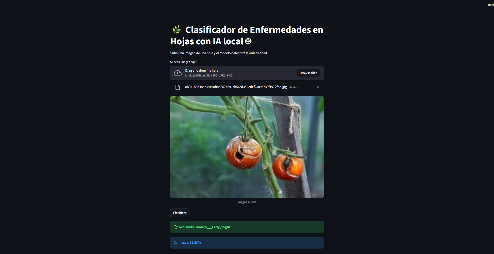
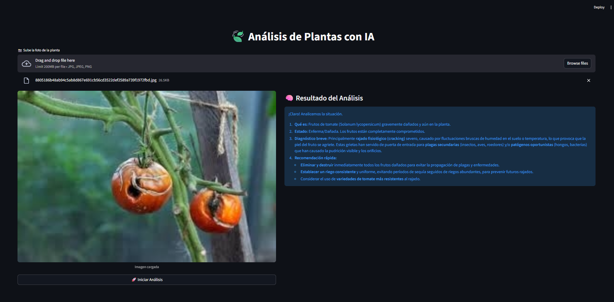

🇪🇸 Español | [🇺🇸 English](README.md)
# 🌱 Detector de Enfermedades en Plantas — Plataforma de IA y Full Stack

### 📌 Descripción General
Este proyecto es una plataforma web completa para la detección automática de enfermedades en plantas usando visión por computador e inteligencia artificial. Fue diseñado e implementado como una solución de ingeniería completa, desde el entrenamiento del modelo hasta el despliegue y la interfaz de usuario.

El sistema ofrece **dos implementaciones independientes** de IA para resolver el mismo problema, demostrando adaptabilidad y sólidas habilidades en arquitectura de software.

---

### 🎥 Demo en Acción
> **[ INSERTA AQUÍ EL LINK A TU VIDEO O GIF ]**
> *Demostración del diagnóstico con el modelo local y la integración con Gemini.*

---

### 📸 Screenshots
| Interfaz del Sistema | Diagnóstico de IA |
| :---: | :---: |
|  |  |

---

### 🧠 Versión 1 — Modelo de Aprendizaje Automático Local
**Carpeta:** `/local-ml-version`

* **Tecnologías:** Python, TensorFlow / Keras, NumPy, PIL, Streamlit.
* **Características:**
  - Entrenamiento de una Red Neuronal Convolucional (CNN) desde cero.
  - Preprocesamiento y normalización de imágenes.
  - Entrenamiento por épocas y evaluación de rendimiento.
  - Visualización del diagnóstico y nivel de confianza.

⚠️ **Archivo del Modelo:** El archivo `.h5` no se incluye por límites de tamaño en GitHub.
- **Descarga el modelo aquí:** [Google Drive Link](https://drive.google.com/drive/folders/1D8QPMVjWAiz_eDDrd5kVoVfdmNFQlbxw?usp=drive_link)
- **Ubicación:** Después de descargar, guárdalo en `local-ml-version/model_plantvillage.h5`.

---

### ☁️ Versión 2 — IA en la Nube con Gemini
**Carpeta:** `/gemini-ai-version`

* **Tecnologías:** Python, Streamlit, API de Google Gemini, dotenv.
* **Características:**
  - Integración de Gemini 2.5 Flash para análisis avanzado.
  - Explicaciones del diagnóstico detalladas generadas por IA.
  - Manejo seguro de credenciales mediante variables de entorno.
  - Arquitectura de inferencia alternativa frente al modelo local.

---

### 🧩 Habilidades Demostradas
* Deep Learning & Visión por Computador.
* Desarrollo Full Stack e Integración de APIs de IA.
* Arquitectura de Software y Procesamiento de Datos.
* Diseño de Aplicaciones Seguras y Soluciones AgriTech.

---

### 🚀 Cómo Ejecutar

1. **Clonar repositorio:**
   ```bash
   git clone [https://github.com/smurhenao/plant-disease-detector.git](https://github.com/smurhenao/plant-disease-detector.git)
   cd plant-disease-detector
Ejecutar Versión Local:

Bash

cd local-ml-version
pip install -r requirements.txt
streamlit run app.py
Ejecutar Versión Gemini:

Bash

cd gemini-ai-version
pip install -r requirements.txt
# Crea un archivo .env a partir de .env.example y agrega tu API KEY
streamlit run app.py
🌍 Aplicaciones
Agricultura de precisión, diagnóstico de cultivos, investigación académica y soluciones AgriTech.

🧑‍💻 Autor
Sebastian Murillo - Ingeniero de Software | Desarrollador Full Stack | IA & Datos